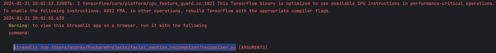
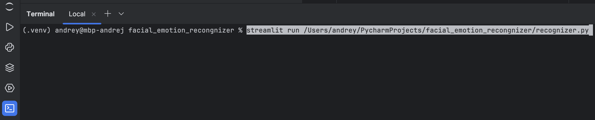

# Приложение для распознавания эмоций человека по фото

## Как работать с приложением
* Необходимо запустить файл recognizer.py и из консоли скопировать команду для запуска веб-страницы:

* Скопированную команду вставить в терминале:

* Откроется веб-страница приложения

* Загружаем изображение

* Нажимаем кнопку Predict и дожидаемся окончания выполнения

